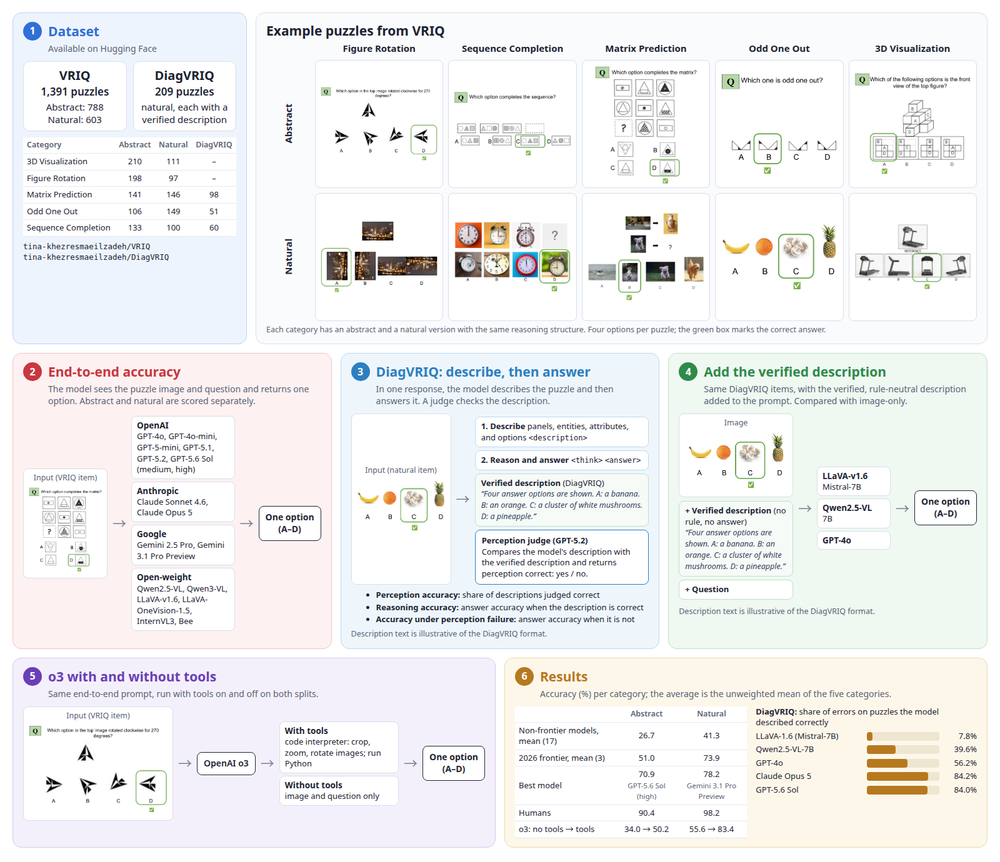

# VRIQ evaluation

Code for the experiments in **VRIQ: Benchmarking and Diagnosing the Visual-Reasoning IQ of Vision–Language Models**.



Puzzle images are not in this repository. The first run of each script downloads them from the Hugging Face Hub and caches them on disk.

| Dataset | Hub repo | What you get |
|---|---|---|
| VRIQ | [`tina-khezresmaeilzadeh/VRIQ`](https://huggingface.co/datasets/tina-khezresmaeilzadeh/VRIQ) | 1,391 puzzles. Abstract 788, natural 603. |
| DiagVRIQ | [`tina-khezresmaeilzadeh/DiagVRIQ`](https://huggingface.co/datasets/tina-khezresmaeilzadeh/DiagVRIQ) | 209 natural puzzles plus a verified text description of each image. |

Counts by category:

| Split | 3D | Figure Rotation | Matrix Prediction | Odd One Out | Sequence Completion | Total |
|---|---:|---:|---:|---:|---:|---:|
| abstract | 210 | 198 | 141 | 106 | 133 | 788 |
| natural | 111 | 97 | 146 | 149 | 100 | 603 |
| DiagVRIQ | — | — | 98 | 51 | 60 | 209 |

Reported averages in the paper are the unweighted mean of the five category accuracies. Each item is scored once. Rows with a blank question or answer are skipped.

## Layout

```text
vriq/
├── e2e/         end-to-end accuracy on VRIQ
│   ├── evaluate.py    open-weight models and OpenAI, including o3
│   ├── claude.py      Claude Sonnet 4.6 and Claude Opus 5
│   └── gemini.py      Gemini 2.5 Pro and Gemini 3.1 Pro Preview
├── diag/        DiagVRIQ: describe the image, then answer
│   ├── claude.py
│   ├── openai.py
│   ├── gemini.py
│   └── judge.py       perception judge
├── augment/     same image, plus the verified description
│   ├── llava.py       LLaVA-1.6-Mistral-7B
│   ├── qwen.py        Qwen2.5-VL-7B
│   └── gpt4o.py       GPT-4o
├── common/      Hub download, prompts, answer extraction
└── models/      one file per model family
```

Run every command from this folder.

## Setup

Python 3.12.

```bash
python3 -m venv .venv
source .venv/bin/activate
pip install -r requirements.txt
```

Export a key only for the provider you call:

```bash
export OPENAI_API_KEY=...
export ANTHROPIC_API_KEY=...
export GEMINI_API_KEY=...
```

Open-weight models also need a CUDA build of PyTorch and `transformers==4.51.3`. The paper used two NVIDIA RTX A6000 GPUs (48 GB each). vLLM is optional and is used only with `--gen_engine vllm`.

```bash
pip install torch --index-url https://download.pytorch.org/whl/cu121
pip install transformers==4.51.3
```

## 1. End-to-end accuracy

The model sees the puzzle image and the question, then returns one option. Run abstract and natural separately.

### OpenAI

`e2e.evaluate` sends `--reasoning_effort high` unless you change it. Pass the value from the table below.

```bash
python -m e2e.evaluate \
  --split abstract \
  --model_name_path gpt-5.6-sol \
  --gen_engine openai \
  --reasoning_effort high \
  --max_new_tokens 16384 \
  --outputs_dir ./results \
  --tag abstract_sol_high
```

| Model id | `--reasoning_effort` | `--max_new_tokens` |
|---|---|---|
| `gpt-5.6-sol` | `high` on the main table, `medium` on the second row | 16384 |
| `gpt-5.1`, `gpt-5.2` | `none` | 1024 |
| `gpt-5-mini`, `o3` | `medium` | 1024 |
| `gpt-4o`, `gpt-4o-mini` | any value is ignored; these models have no reasoning-effort control | 1024 |

Natural is the same command with `--split natural`.

JSON files land in `./results/visreasoning/`.

### Open-weight

Greedy decoding, temperature 0. Example for the 7B model in the main table:

```bash
python -m e2e.evaluate \
  --split abstract \
  --model_name_path Qwen/Qwen2.5-VL-7B-Instruct \
  --gen_engine hf \
  --temperature 0 \
  --max_new_tokens 512 \
  --outputs_dir ./results \
  --tag abstract_qwen25vl7b
```

Other checkpoints from the paper, passed the same way:

| Model | `--model_name_path` |
|---|---|
| Qwen2.5-VL-3B | `Qwen/Qwen2.5-VL-3B-Instruct` |
| Qwen2.5-VL-3B-AWQ | `Qwen/Qwen2.5-VL-3B-Instruct-AWQ` |
| Qwen3-VL-32B-Thinking | `Qwen/Qwen3-VL-32B-Thinking` |
| InternVL3-9B | `OpenGVLab/InternVL3-9B` |
| LLaVA-1.6-Mistral-7B | `llava-hf/llava-v1.6-mistral-7b-hf` |
| LLaVA-1.6-Vicuna-7B | `llava-hf/llava-v1.6-vicuna-7b-hf` |
| LLaVA-1.6-34B | `llava-hf/llava-v1.6-34b-hf` |
| LLaVA-OneVision-1.5-8B-RL | a local or Hub id whose name contains `onevision-1.5` |
| Bee-8B-RL | a local or Hub id whose name contains `bee` |

Use `--gen_engine vllm` instead of `hf` to serve the same checkpoint with vLLM.

### Claude

Opus 5 turns on adaptive thinking at effort high. Sonnet 4.6 does not.

```bash
python -m e2e.claude --split abstract --model claude-sonnet-4-6
python -m e2e.claude --split abstract --model claude-opus-5 --max_tokens 8192
```

### Gemini

Gemini 3.1 Pro Preview uses thinking level high. Gemini 2.5 Pro does not.

```bash
python -m e2e.gemini --split abstract --model gemini-2.5-pro
python -m e2e.gemini --split abstract --model gemini-3.1-pro-preview
```

## 2. DiagVRIQ: describe, then answer

One response. The model first writes what it sees, then chooses an option. The data are the 209 DiagVRIQ items.

```bash
python -m diag.claude --phase two_stage --model claude-opus-5
python -m diag.openai --model gpt-5.6-sol
python -m diag.gemini --model gemini-3.1-pro-preview
```

`diag.openai` does not send a reasoning-effort field. For `gpt-5.6-sol` that selects medium, which is the DiagVRIQ setting in the paper.

### Perception judge

GPT-5.2 compares the model's description with the verified description and returns a yes/no perception label. Point `--model_output` at the JSON file written by one of the commands above.

```bash
python -m diag.judge \
  --model_output ./results/claude-opus-5_diagvriq_two_stage.json \
  --use_llm_judge \
  --judge_model gpt-5.2 \
  --table_model_name "Claude Opus 5"
```

## 3. Give the model the verified description

The image is still shown. The verified DiagVRIQ description is added to the prompt. The paper reports three models here: LLaVA-1.6-Mistral-7B, Qwen2.5-VL-7B, and GPT-4o.

```bash
python -m augment.llava
python -m augment.qwen
python -m augment.gpt4o
```

Those commands already select the three checkpoints above. LLaVA loads with `--gen_engine hf`. Qwen loads with `--gen_engine vllm`. GPT-4o uses `OPENAI_API_KEY`.

## 4. o3 with tools

Same prompt as the end-to-end run. Tools on, then tools off. Run both splits. `code_interpreter` covers image edits, extra computation, and code execution together.

```bash
python -m e2e.evaluate \
  --split abstract \
  --model_name_path o3 \
  --gen_engine openai \
  --reasoning_effort medium \
  --outputs_dir ./results \
  --tag abstract_o3_tools

python -m e2e.evaluate \
  --split abstract \
  --model_name_path o3 \
  --gen_engine openai \
  --reasoning_effort medium \
  --no_o3_tools \
  --outputs_dir ./results \
  --tag abstract_o3_no_tools
```

Repeat both with `--split natural`.

## Images

Leaving `--dataset_root` empty downloads the Hub dataset. `e2e.evaluate` resizes each image to at most 250,000 pixels, with each side at least 28 pixels.

A local folder still works. It must contain category subfolders, each with a CSV whose columns are `PID`, `Category`, `Question`, and `Ground truth`, and images named from the PID (`1.png`, `1.jpg`, and so on).
